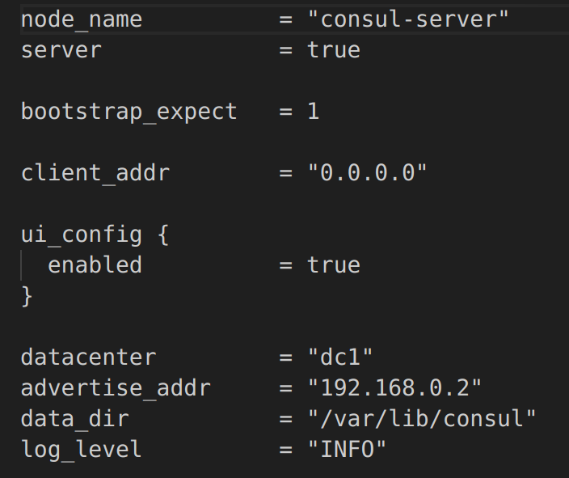

## Part 1. Remote node configuration via Ansible

1) Create three machines using Vagrant - manager, node01, node02. Do not install docker using shell scripts when creating machines on Vagrant! Forward the node01 ports to the local machine to access the undeployed microservice application.

2) Prepare manager as a workstation for remote configuration.
- Go to manager. 
- Check the connection to node01 via ssh on a private network. 
- Generate a ssh key to connect to node01 from the manager.

- Copy the docker-compose file and the source code of the microservices to the manager.
- Install Ansible on the manager and create ansible folder in which create the inventory file.

 
- Use the ping module to check the connection via Ansible. 

- Place the result of the module in a report.

3) Write the first playbook for Ansible that performs apt update, installs docker, docker-compose, copies the compose file from the manager and deploys the microservice application. 

4) Run the prepared tests through postman and make sure that they are all successful. Show the test results in the report.

5) Form three roles: 
 - the application role performs the deployment of a microservice application using docker-compose,
 - apache installs and runs the standard apache server
 - postgres installs and runs postgres, creates a database with an arbitrary table and adds three arbitrary records to it. 
 - Assign the first role to node01 and the second two roles to node02, check the functionality of the microservices application with postman tests, make sure that postgres and the apache server are available. For Apache, a web page should open in the browser. As for PostgreSQL, you need to connect from the local machine and display the contents of the previously created table with data.

6) Place the files created in this part in the `src\ansible01` folder in your personal repository.

## Part 2. Service Discovery

1) Write two configuration files for consul:
- consul_server.hcl:
   - set up the agent as a server;
   - specify the interface directed to the internal Vagrant network in advertise_addr
- consul_client.hcl:
   - set up the agent as a client;
   - specify the interface directed to the internal Vagrant network in advertise_addr 

2) Create three machines using Vagrant - consul_server, api, manager and db. 
- Forward port 8082 from the api to the local machine to access the still undeployed api
- Forward port 8500 with the manager to access the ui consul. 

3) Write a playbook for ansible and four roles: 
- install_consul_server, which:
   - works with consul_server;
   - copies consul_server.hcl;
   - installs consul and all necessary dependencies for it;
   - runs consul service
- install_consul_client, which:
   - works with api and db;
   - copies consul_client.hcl;
   - installs consul, envoy all necessary dependencies for consul; 
   - runs consul and consul-envoy services;
- install_db, which:
   - works with db;
   - installs postgres and runs it;
   - creates `hotels_db` database;
- install_hotels_service, which:
   - works with api;
   - copies the service source code
   - installs `openjdk-8-jdk`
   - Creates global environment variables:
      - POSTGRES_HOST="127.0.0.1"
      - POSTGRES_PORT="5432"
      - POSTGRES_DB="hotels_db"
      - POSTGRES_USER="<user name>"
      - POSTGRES_PASSWORD="<user password>"
   - runs the built jar file with the command: `java -jar /opt/target/hotel-service-0.0.1-SNAPSHOT.jar.jar`

4) Check the functionality of CRUD operations on hotel service. Show the test results in the report.

5) Place the files created in this part in the `src\ansible02` and `src\consul01` folders in your personal repository.
